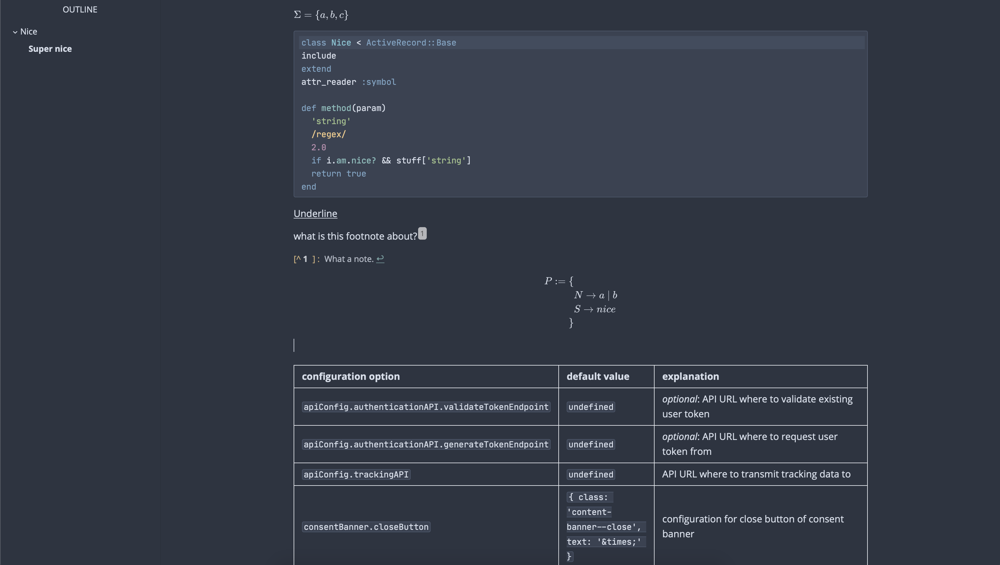

# Typora – Nord Theme

This is an adaptation of the [Nord theme](https://nordtheme.com) for the Markdown Editor [Typora](https://typora.io).

## Installation

Once you have Typora installed, simply copy the contents of the
`src`-Folder into your Typora Themes folder (Preferences > Appearance > Themes > Open Theme Folder).

Then, you can select the `Nord` theme from your Theme list in the menu bar.

## Credits

- The [Nord CSS Color Palette](https://github.com/arcticicestudio/nord/blob/develop/src/nord.css)
- [AmmarCodes's implementation](https://github.com/AmmarCodes/typora-nord-theme)
- [CodeMirror's implementation](https://github.com/codemirror/CodeMirror/blob/1f82eed9cb135848f4815852d99939ab10d49a76/theme/nord.css) of the Nord theme

## License

GNU GPL licensed

Copyright (C) 2020 Joe Pantazidis
